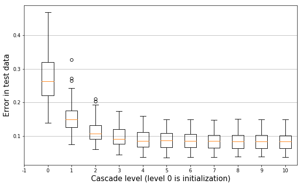
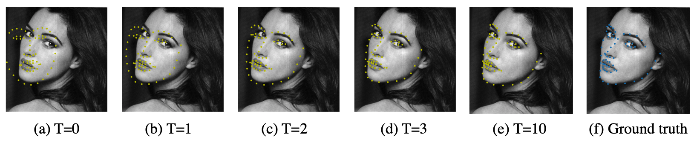
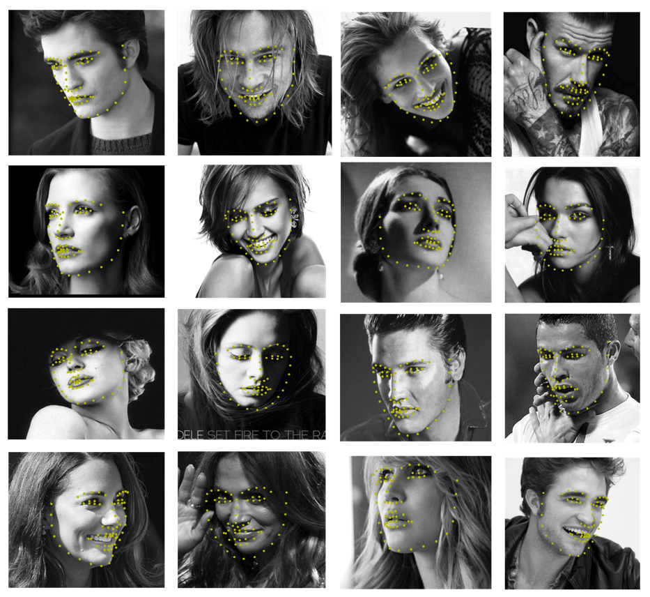

# face-alignment-ert-2D
implement of "One millisecond face alignment with an ensemble of regression tree" in python. The code is strongly depends and refers the menpo and facefit project.

### Description

Face alignment is a process that estimate the face’s landmarks position or face shape from face images, and it is widely used in research and commercial applications, including, object pose estimation, face recognition, 3D reconstruction and automatic face beautification. However, the efficient and accuracy to estimate the face’s landmarks position did not meet practical requirements until 2014. At that time, a milestone model [1] was invented to solve this problem directly from a sparse subset of pixel intensities, achieving super-realtime and high prediction accuracy performance on standard dataset. The new model was based on ensemble of gradient boosting tree that optimizes the sum of landmarks position square error loss and appropriate priors of image data structure in feature selection. Here we train the model in iBUG 300W dataset, which composed of 600 face images with different pose, illumination, expression and corresponding coordinate annotations of 68 landmarks, and then test the model in a small independent dataset. See **training_demo.py**

### Result

We perform the experiment on iBUG 300W dataset with the following fixed parameter settings. The
learning rate v is 0.1, number of regressor in the casecade is T=10, and each rt comprises of K = 500 trees. The depth of trees is set to F = 5. At each level of the cascade P = 400 pixel locations are sampled from the image. We randomly generate 20 candidate split for each node of tree in the training process and find the best split from them. To augment the training data sample size, we use 20 different initializations for each training example. The runtime complexity of the algorithm on a single image is constant O(TKF). The complexity of the training time depends linearly on the training data sample size O(NDTKFS) where N is the number of training data and D is dimension of the targets. Figure 1 shows the prediction error on test data at different levels of the cascade, which shows that algorithm can reduce the error very fast. The error is the average normalized distance of each landmark to its ground truth position. The distances are normalized by dividing by the interocular distance. Figure 2 show the landmark estimates at different levels of the cascade initialized with the mean shape centered at the output of menpo face detector. After the first few level of the cascade, the error is already greatly reduced.

​                                                    <em>Fig. 1: The Prediction error at each level of the cascade</em>

​                                          <em>Fig. 2: Landmark estimates at different levels of the cascade</em>

​                                            <em>Fig. 3:More face image with estimated landmarks position</em>

### Dependence

Python 3.6.8  
numpy 1.16.2  
menpo 0.8.1  
menpodetect 0.5.0  
menpofit 0.5.0

### Reference

[1]	Kazemi V, Sullivan J One millisecond face alignment with an ensemble of regression tree. In
*Proceedings of the IEEE conference on computer vision and pattern recognition*, 2014.